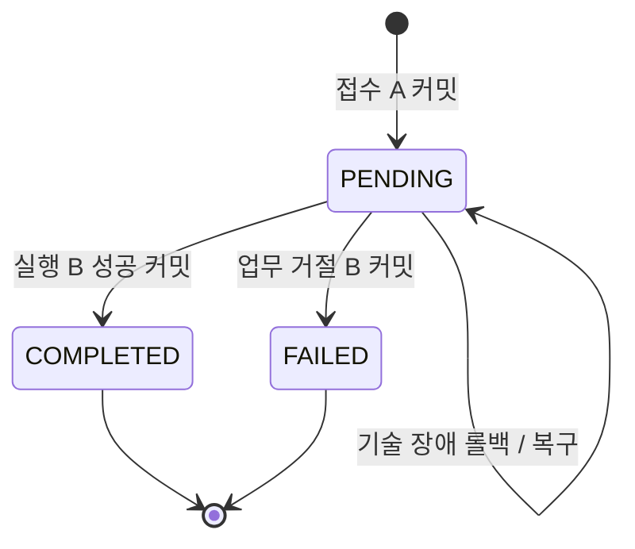

# ADR-0002: PostgreSQL에서 요청 접수와 금융 실행을 분리한다

- 상태: 승인(설계) · 2026-09-14
- 관련: [요구사항](../requirements.md), [데이터 모델](../data-model.md)

## 맥락

금액 변경이 롤백되어도 접수된 요청은 남아야 한다. 단일 트랜잭션에서 모든 상태를 만들면 롤백 후 실패/PENDING 기록이 사라지고, 응답 유실을 실패로 단정하면 중복 송금을 유발할 수 있다. DB 잠금이 유지되는 실행과 영속적인 요청 식별을 분리한다.

## 결정 1: 접수 트랜잭션 A

1. 인증, CSRF, 형식, 고객 소유권 및 수취 계좌 존재를 먼저 검증한다. 사전 검증 실패는 거래를 접수하지 않고 키를 소비하지 않는다. 접수 후 실행 시 업무 조건은 다시 확인한다.
2. 클라이언트는 16~128자의 ASCII 키를 보낸다. `(customer_id, idempotency_key)`에 UNIQUE를 둔다. HTTP 메서드, 정규화된 route, 출금 계좌 ID, 수취 계좌번호, 정수 금액, 통화를 정렬된 고정 표현으로 직렬화해 SHA-256 해시를 만든다. JSON 공백/필드 순서는 영향을 주지 않는다.
3. `money_transactions(PENDING)`와 `idempotency_requests`를 함께 생성하고 커밋한다. 같은 키 삽입 경쟁은 UNIQUE로 승자를 정하며 패자는 롤백 후 기존 기록을 별도 조회한다.
4. 기존 키의 해시가 다르면 `409 IDEMPOTENCY_CONFLICT`. 같으면 같은 거래를 조회/실행한다. 다만 현재 인증·소유권 검증을 우회하여 이전 응답을 노출하지 않는다.

키는 MVP에서 만료/삭제하지 않는다. 키를 임의로 해제하면 늦은 재요청이 새로운 송금이 되기 때문이다. 예약 등록 요청도 이 키 공간을 공유하지만 등록 API의 route와 실행 시각이 해시에 포함되고 결과는 예약 ID다. 예약 실행은 클라이언트 키를 새로 만들지 않고 `scheduled_transfer_id UNIQUE`를 가진 내부 거래를 만든다.

## 결정 2: 실행 트랜잭션 B

격리 수준은 READ COMMITTED, 정확성은 명시적 행 잠금과 UNIQUE/CHECK로 확보한다. 실행 후보마다 다음 순서를 따른다.

1. `money_transactions` 행 `FOR UPDATE`. 이미 종결됐다면 그 결과를 반환한다.
2. 예약 실행이면 해당 `scheduled_transfers` 행을 잠근다.
3. `banking_clock` 단일 행 `FOR SHARE`. 자정이 지났으나 마감이 아직이면 금액 실행을 보류한다. 현재 business_date는 여기서 정한다.
4. 요청 고객의 `customer_policies` 행 `FOR UPDATE`. 이 행은 가입 시 반드시 생성한다. 모든 금액 실행·고객 역할 변경·한도 변경이 이 잠금에 참여한다.
5. 관련 고객 계좌들을 ID 오름차순 `FOR UPDATE`로 잠근다. 입출금은 하나, 이체는 둘이다.
6. 권한, 계좌 상태, 잔액, 수취 잔액 상한, 한도를 검증한다. `daily_transfer_usage`가 없으면 0으로 만들고 사용액을 읽는다. 같은 고객의 정책 행을 이미 잠갔으므로 날짜 행 최초 생성 경쟁도 제어된다.
7. 업무상 실패이면 잔액/원장/한도를 쓰기 전에 `FAILED`, 실패 코드, 확정 응답을 저장한다. 예약이면 예약도 FAILED로 바꾸고 커밋한다.
8. 성공이면 양쪽 잔액, 균형 잡힌 원장 2건, 당일 사용량, COMPLETED 상태, 거래 결과를 같은 트랜잭션에서 저장한다. 예약 상태도 COMPLETED로 바꾼다.

원장 삽입은 독립 커밋하지 않는다. 기술 예외가 발생하면 B 전체가 롤백되어 A의 PENDING만 남는다. UPDATE 뒤 실패를 감지하여 같은 트랜잭션을 FAILED로 커밋하는 구현은 금지한다. 예상 가능한 업무 검증을 쓰기보다 먼저 수행하고, 쓰기 이후 발견된 제약 위반은 전체 롤백 후 조사한다.

고객 정책 잠금은 같은 고객의 서로 다른 출금 계좌에 대한 한도 경쟁을 막는다. 계좌 ID 순 잠금은 A→B와 B→A 교차이체의 순환 대기를 줄인다. 내부 현금 정산계정은 변경 가능한 잔액을 저장하지 않으므로 모든 입금이 하나의 내부 계정 잔액 락을 경쟁하지 않는다.

## 상태 전이와 응답

- 최초 또는 재요청에서 처리가 완료됐으면 `201`과 저장된 성공 본문, 업무 실패면 저장된 `422`/`403`과 오류 본문을 반환한다.
- 다른 실행자가 거래 행을 보유하거나 동기 실행 제한시간(기본 2초)을 넘기면 요청은 `202`, 거래 ID, 조회 URL을 반환한다. 이미 진행 중인 DB 작업을 202 반환 때문에 FAILED로 바꾸지 않는다.
- `GET` 조회는 200과 현재 상태다. 재조회는 새로운 송금을 만들지 않는다.
- DB에 접수됐는지조차 알 수 없는 연결 오류에는 503을 반환할 수 있다. 클라이언트는 **원래 키 그대로** 다시 요청한다.
- 실패 결과는 재요청으로 성공으로 바뀌지 않는다. 고객이 수정해서 다시 보내는 거래는 새 키를 쓴다.

## 복구와 예약 경쟁

복구 워커는 일정 시간(초기값 30초) 이상 PENDING인 거래를 ID로 탐색하고 실행기 B를 호출한다. 워커끼리 거래 행 잠금으로 경쟁하며 `SKIP LOCKED`를 이용한 후보 선점을 구현 단계에서 적용할 수 있다. 잠금 타임아웃/데드락은 전체 롤백하고 백오프한다. 반복 오류는 지표·로그로 알리고 PENDING을 유지한다. 커밋 여부가 불확실한 거래를 FAILED로 추정하지 않는다.

예약 상태는 SCHEDULED → PROCESSING → COMPLETED/FAILED, 또는 SCHEDULED → CANCELLED다. 예약 선점 트랜잭션은 예약 행만 잠가 상태를 바꾸고 실행 거래를 생성하여 함께 커밋한다. 이미 PROCESSING이면 기존 거래를 사용한다. 선점 트랜잭션에서 금융 실행기를 호출하지 않고 커밋 후 실행한다. 따라서 예약 행 → 거래 행의 역순 잠금이 생기지 않는다.

취소는 예약 행을 잠그고 SCHEDULED일 때만 성공한다. PROCESSING이면 409다. 예약 등록은 관련 계좌를 ID 순으로 잠그고 상태를 검사한 뒤 예약을 삽입한다. 계좌 해지는 동일한 계좌 잠금을 잡은 상태에서 출금·수취 계좌로 연결된 SCHEDULED/PROCESSING 예약의 존재를 조회한다. 해지는 예약 행 잠금을 추가 획득하지 않는다. 이 규칙으로 등록과 해지 사이 검사/삽입 경쟁을 막는다.

## 대안과 제약

- 낙관적 락: 충돌 시 재시도 비용을 측정할 후보지만 첫 구현은 비관적 락으로 단순화한다.
- 원자적 조건부 UPDATE: 단일 잔액에는 적합하며 향후 실험 대상으로 남긴다. 두 계좌/원장/고객별 한도 경계는 별도 조율이 필요하다.
- Redis 분산 락: TTL과 DB 커밋 경계가 달라 DB 제약을 대체하지 못한다.
- 명령 한 개가 접수와 실행 두 번 커밋하므로 처리량 비용과 PENDING 운영 책임이 생긴다. 처리량 수치는 후속 실험으로 검증한다.

## 검증 계획

AC-003~005, AC-007~011 및 AC-014~016을 PostgreSQL 통합 테스트로 구현한다. 특히 접수 직후 종료, 첫 잔액 UPDATE 후 예외, 커밋 후 응답 유실을 각각 주입한다. 행 잠금/커밋을 모킹한 단위 테스트만으로 합격 처리하지 않는다.
