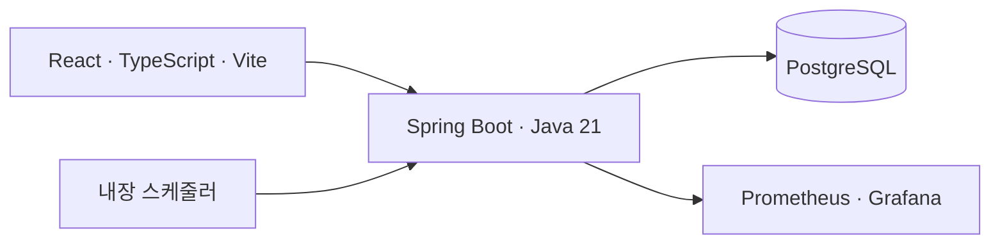
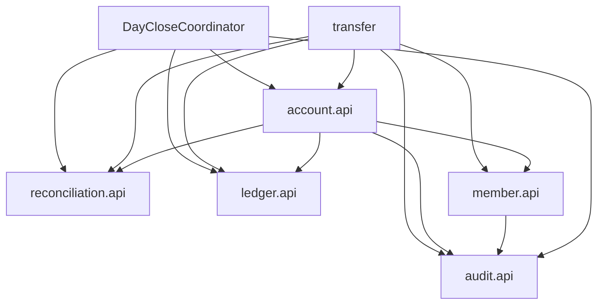

# 2단계: 아키텍처와 모듈 경계

상태: 설계 기준선 · 2026-09-14. 아래 디렉터리는 생성 예정 구조다. 현재 실행 애플리케이션은 없다.

2026-09-15 진행 사항: 기본 서버와 React 연결 확인 화면이 추가되었다. 현재 실행 구성은 [로컬 개발 안내](local-development.md)를 따른다. 아래 업무 모듈은 계속 구현 예정 구조다.

## 1. 실행 구조

반응형 웹과 Spring Boot 서버를 같은 사이트 아래 배포한다. 프런트엔드는 `/api/v1`을 호출한다. 서버 하나와 PostgreSQL 하나에서 금융 상태를 함께 커밋한다. Redis는 초기 정합성 경로에 넣지 않으며 캐시나 세션 확장이 필요할 때 도입한다. 의존성의 정확한 버전은 3단계 부트스트랩 시 호환성을 확인하고 고정한다.



## 2. 소스 구성

```text
backend/
  src/main/java/com/bankcorelab/
    BankCoreApplication.java
    member/{api,internal}
    account/{api,internal}
    transfer/{api,internal}
    ledger/{api,internal}
    reconciliation/{api,internal}
    audit/{api,internal}
    shared/
  src/main/resources/db/migration/
  src/test/
frontend/
docs/
infra/
```

각 `api`는 다른 모듈이 호출할 Java 인터페이스, ID, 불변 DTO만 공개한다. `internal` 안에 HTTP controller, application, domain, persistence를 배치한다. JPA entity/repository를 외부로 노출하지 않는다. `shared`는 금액 값 객체, 오류 규약, 시계 추상화 정도로 제한하며 업무 서비스와 DB 접근을 넣지 않는다. DB 외래키는 데이터 정합성을 위한 관계이며 Java 모듈 의존성을 의미하지 않는다.

## 3. 소유권과 공개 기능

| 모듈 | 소유 테이블 | 책임 / 공개 계약 |
|---|---|---|
| member | members, customer_policies, daily_transfer_usage | 인증, 역할, 고객 상태, 정책 잠금 및 한도 사용. `MemberAccess`, `TransferAllowance` |
| account | accounts | 계좌 개설·상태·소유권·잔액. `AccountAccess`, `BalanceWriter`, `BalanceSnapshotReader` |
| transfer | money_transactions, idempotency_requests, scheduled_transfers | 입출금/이체 유스케이스와 전체 트랜잭션, 예약·해지 조율. `MoneyCommands`, `TransferQueries` |
| ledger | ledger_accounts, journal_entries | 내부/고객 원장 계정, 균형 잡힌 분개 추가. `JournalWriter`, `LedgerSnapshotReader` |
| reconciliation | banking_clock, day_closures, balance_snapshots, reconciliation_runs, reconciliation_results | 영업일 게이트, 마감, 대사. `BusinessDayGate` |
| audit | audit_events | 최소 정보 감사 이벤트 기록. `AuditRecorder` |

순환 의존성을 피하기 위해 영업일 게이트는 reconciliation의 공개 API만 참조한다. 아래 상호 관계처럼 보일 수 있는 마감 협력은 **애플리케이션 최상위 조립 계층**의 `DayCloseCoordinator`가 account/ledger/reconciliation API를 호출하여 조율한다. reconciliation 내부는 account/ledger에 의존하지 않고 스냅샷 DTO를 받아 저장한다. coordinator는 업무 테이블을 직접 조회하지 않는다.



- 금융 controller는 transfer 유스케이스를 호출한다. account의 잔액 쓰기는 금융 트랜잭션 안에서만 허용한다.
- 계좌 해지 HTTP 유스케이스는 transfer가 조율하여 예약 참조 유무를 검사하고 account의 해지 API를 호출한다. account → transfer 역방향 의존은 금지한다.
- 계좌 개설 시 account가 ledger의 고객 원장 계정을 함께 생성한다. 회원 생성과 계좌 개설은 별도 유스케이스다.
- 같은 금융 트랜잭션에서 호출하는 쓰기 API는 기존 트랜잭션 필수(`MANDATORY` 적용 예정). 모듈 호출 중 독립 커밋이나 비동기 원장 작성을 금지한다.
- 감사 테이블은 다른 모듈을 호출하지 않고, actor/target ID를 일반 값으로 보관한다.
- 후속 구현에서 ArchUnit 등으로 `internal` 접근과 순환 참조를 검증한다. 지금은 설계 검토만 완료했다.

## 4. 금액 변경의 경계

1. 로그인·CSRF·본문 형식을 확인한다.
2. 짧은 접수 트랜잭션에서 고객+멱등성 키를 등록하고 `PENDING` 거래를 만든다.
3. 실행 트랜잭션에서 거래를 잠그고 현재 영업일, 권한, 계좌 상태, 잔액, 한도를 재검증한다.
4. 고객 잔액, 원장 두 항목, 한도 사용량, 성공 상태 및 재응답 정보를 한 번에 커밋한다.
5. 커밋된 결과를 HTTP로 돌려준다. 복구 워커도 3~4의 동일한 실행기를 사용한다.

상태와 잠금의 구체 규칙은 [ADR-0002](adr/0002-transaction-idempotency.md)에 있다. 금융 처리의 안정성에 Redis 락, 메시지 브로커, 프로세스 메모리 플래그를 의존하지 않는다.

## 5. 인증·감사·운영

- Spring Security 서버 세션을 선택한다. 초기 단일 인스턴스에서는 메모리 세션으로 시작하며 재시작 시 재로그인한다. 거래 복구는 DB 상태에 기반하므로 로그인 세션과 분리된다.
- 브라우저 쿠키는 배포 환경에서 Secure/HttpOnly/SameSite=Lax. 상태 변경 API에 CSRF 토큰을 요구한다. 회원가입/로그인을 포함한 세부 계약은 [API 명세](api.md)에 있다.
- 역할은 CUSTOMER/OPERATOR/ADMIN 중 하나. ADMIN은 고객 거래 권한이나 직원 조회 권한을 자동 상속하지 않는다. 공개 회원가입은 CUSTOMER만 생성한다. 최초 관리자는 로컬 초기화 절차로 만들며 운영 배포에 데모 비밀번호를 포함하지 않는다.
- 거래 실행 시 DB의 고객 상태/역할과 출금 계좌 소유권을 다시 확인한다. 세션에 저장된 오래된 역할만으로 인가하지 않는다.
- 감사 기록 실패 시 관리 변경을 롤백하고 보호 대상 조회 응답도 실패시킨다. 로그인 시도는 성공/실패만 저장하며 비밀번호·세션·원문 계좌번호는 저장하지 않는다.
- 지표: 거래 종류/상태별 건수, 실행 시간, PENDING 최장 대기, DB 락 대기/오류, 마감 지연, 배치 진행률·불일치 수. 회원/계좌/거래 ID를 지표 라벨에 넣지 않는다.
- 웹 화면은 로그인/가입, 계좌 목록·상세, 입출금·이체·예약, 직원 거래/대사, 관리자 역할/한도 설정으로 제한한다.

## 6. 개발 순서와 완료의 의미

3단계에서 Gradle Wrapper, Spring Boot, PostgreSQL 개발 환경, 마이그레이션, 회원·계좌와 보안 최소 골격을 만든다. 4단계부터 금액·원장·멱등성의 최소 수직 기능을 함께 구현하고, 5단계에서 병렬/장애 테스트를 강화한다. README의 단계 순서는 기능 완성 순서이며 원장이나 인가 없이 금융 쓰기 기능을 공개한다는 뜻이 아니다.

이번 단계의 완료는 요구사항·설계·검증 계획이 서로 대응한다는 뜻이다. 성능 수치, 금융 불변식 통과, 운영 준비 완료를 주장하지 않는다.
