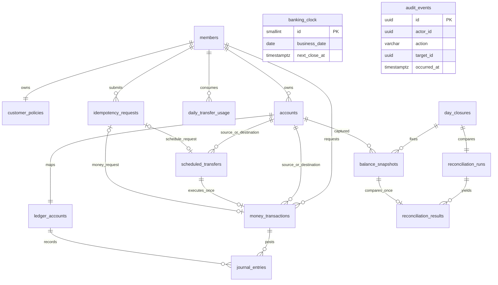

# 2단계: ERD와 데이터 사전

상태: 논리/물리 설계 기준선 · 2026-09-14. 실제 DDL과 마이그레이션은 3단계 이후 작성한다.

## 1. 공통 규약

- 별도 표기가 없으면 PK는 애플리케이션 생성 UUID, 생성 시각은 `TIMESTAMPTZ NOT NULL`이다. 외부 API ID도 UUID 문자열이다.
- 금액은 `BIGINT`, 집계는 `NUMERIC(38,0)`를 사용한다. 고객 잔액 상한은 10^12원, 원장 항목 금액은 1~10^12원이다. 설정된 1회 한도는 이보다 작거나 같다.
- FK 삭제는 RESTRICT, 금액·원장·회원·계좌를 cascade 삭제하지 않는다. 상태로 비활성화한다.
- 상태는 VARCHAR+CHECK로 명시한다. UNIQUE/CHECK/NOT NULL은 마이그레이션에 선언하고 서비스 검증으로 대체하지 않는다.
- 표의 `?`는 NULL 허용이다. 그 외 필드는 NOT NULL이다. 각 테이블의 enum과 날짜 CHECK도 적용한다.

## 2. ERD

관계선의 `source_or_destination`은 실제 두 개 FK를 줄여 표현했다. 내부 현금 ledger_account에는 customer account가 없다. 실제 accounts → ledger_accounts 관계는 고객 계정에만 1:1이며 전체 ledger_accounts에는 추가 내부 행이 존재한다. audit의 대상은 여러 업무 객체를 가리키는 식별 정보이므로 직접 FK가 아니다. banking_clock은 특정 마감 행에 FK를 두지 않는 단일 제어 행이다.

## 3. 테이블 사전

### members / customer_policies / daily_transfer_usage

| 테이블 | 주요 컬럼 | 제약 및 인덱스 |
|---|---|---|
| members | id, login_id VARCHAR(50), password_hash VARCHAR(255), role VARCHAR(16), status VARCHAR(16), created_at | login_id UNIQUE(소문자 정규화), role CUSTOMER/OPERATOR/ADMIN, status ACTIVE/DISABLED |
| customer_policies | customer_id UUID PK/FK members, per_transaction_limit BIGINT, daily_transfer_limit BIGINT, updated_at | 모든 회원 생성 시 1행. 각 한도 1~10^12. 역할 변경/거래 실행의 공통 잠금 대상 |
| daily_transfer_usage | customer_id FK members, business_date DATE, used_amount BIGINT | 복합 PK(customer_id,business_date), used_amount ≥ 0. 성공 내부이체만 증가 |

한도가 낮아져 이미 사용한 액수보다 작아질 수 있으므로 사용액≤현재 설정한도 CHECK는 두지 않는다. 이 경우 신규 이체의 가용 한도는 0이다. 거절/예약 등록 시 사용액을 증가시키지 않는다. ADMIN→CUSTOMER 등 역할 변경은 기존 계좌를 삭제하지 않으며 고객 역할이 아닐 때 금융 실행을 거절한다.

### accounts

`id`, `owner_id FK members`, `account_number CHAR(12) UNIQUE`, `currency CHAR(3)`, `status VARCHAR(16)`, `balance BIGINT`, `created_at`, `closed_at TIMESTAMPTZ?`.

- 계좌번호는 12자리 숫자의 가상 번호. 충돌은 UNIQUE로 감지해 재생성하며 실제 은행 번호 규칙을 모방하지 않는다.
- currency='KRW', status IN ACTIVE/FROZEN/CLOSED, 0≤balance≤10^12.
- CLOSED이면 balance=0 및 closed_at NOT NULL. 그 외 closed_at NULL.
- INDEX(owner_id,created_at,id). 계좌 소유자는 변경하지 않는다.
- 미처리 예약 부재는 CHECK로 표현할 수 없으므로 계좌 잠금 + 예약 존재 조회로 보장한다.

### ledger_accounts

`id`, `kind VARCHAR(24)`, `customer_account_id UUID? FK accounts UNIQUE`, `system_code VARCHAR(40)? UNIQUE`, `normal_side VARCHAR(6)`, `created_at`.

- CUSTOMER_DEPOSIT: customer_account_id 필수, system_code NULL, normal_side=CREDIT.
- CASH_CLEARING: customer_account_id NULL, system_code='CASH_CLEARING', normal_side=DEBIT.
- 두 형식의 조합을 CHECK. 고객 계좌 생성과 고객 ledger_account 생성은 같은 트랜잭션.
- 내부 CASH_CLEARING은 마이그레이션 seed로 정확히 하나 생성한다. 변경 가능한 balance는 저장하지 않는다.

### money_transactions

입금·출금·이체를 하나의 테이블에서 관리한다. transfer 모듈이 소유하되 테이블 이름은 거래 종류를 포괄하도록 정했다.

| 컬럼 | 타입/규칙 |
|---|---|
| id / customer_id | UUID PK / UUID FK members |
| kind | DEPOSIT/WITHDRAWAL/TRANSFER |
| source_account_id / destination_account_id | UUID? 각각 FK accounts |
| amount / currency | BIGINT 양수·상한 10^12 / CHAR(3) KRW |
| status | PENDING/COMPLETED/FAILED |
| scheduled_transfer_id | UUID? FK scheduled_transfers UNIQUE |
| business_date | DATE? 실행 시 확정; 종결 상태에는 필수 |
| created_at / completed_at | TIMESTAMPTZ / TIMESTAMPTZ? (종결 시각; FAILED에도 설정) |
| failure_code | VARCHAR(64)? FAILED에서만 필수 |
| final_http_status / final_response | SMALLINT? / JSONB? 종결 시 필수. 최소 결과 DTO만 저장 |

- DEPOSIT: source NULL, destination 필수. WITHDRAWAL은 그 반대. TRANSFER는 두 계좌 필수 및 서로 다름.
- PENDING이면 business_date/completed_at/failure_code/final_* NULL. COMPLETED면 failure_code NULL. 종결 결과 불변.
- INDEX(customer_id,created_at DESC,id DESC), INDEX(status,created_at,id) WHERE status='PENDING', INDEX(business_date,status).
- ID/접수 날짜 기준 조회와 실행 business_date 기준 집계를 구분한다.

### idempotency_requests

`id`, `customer_id FK members`, `idempotency_key VARCHAR(128)`, `request_hash CHAR(64)`, `operation VARCHAR(32)`, `transaction_id UUID? FK money_transactions UNIQUE`, `schedule_id UUID? FK scheduled_transfers UNIQUE`, `created_at`, `registration_response JSONB?`.

- UNIQUE(customer_id,idempotency_key). transaction_id/schedule_id는 정확히 하나만 NOT NULL.
- operation DEPOSIT/WITHDRAWAL/TRANSFER/CREATE_SCHEDULE. CREATE_SCHEDULE일 때만 schedule_id와 registration_response 필수.
- 일반 금액 거래는 money_transactions의 final_response를 재사용한다. 예약 등록 재요청은 저장된 최초 등록 응답을 반환하고 현재 상태는 예약 조회로 확인한다.
- 인증 헤더/비밀번호/원문 요청을 보관하지 않는다. 수취 계좌번호는 해시 입력에만 사용하고 거래 참조는 UUID로 저장한다.

### scheduled_transfers

`id`, `customer_id FK members`, `source_account_id FK accounts`, `destination_account_id FK accounts`, `amount BIGINT`, `currency CHAR(3)`, `execute_at TIMESTAMPTZ`, `status VARCHAR(16)`, `created_at`, `finished_at TIMESTAMPTZ?`, `failure_code VARCHAR(64)?`.

- source≠destination, amount 1~10^12, currency KRW. 예약 최대 30일/미래 여부는 서버 접수 시 검증.
- 상태 SCHEDULED/PROCESSING/COMPLETED/FAILED/CANCELLED. 종결 상태에 finished_at 필수, failure_code는 FAILED만.
- INDEX(execute_at,id) WHERE status='SCHEDULED'. source/destination 각각 INDEX(account_id,status)는 계좌 해지 검사에 사용.
- money_transactions가 예약을 참조하므로 예약 테이블에는 역방향 transaction FK를 추가하지 않는다. 거래 조회는 scheduled_transfer_id UNIQUE로 찾는다.

### journal_entries

`id`, `transaction_id FK money_transactions`, `ledger_account_id FK ledger_accounts`, `side VARCHAR(6)`, `amount BIGINT`, `business_date DATE`, `created_at`.

- side DEBIT/CREDIT, amount 1~10^12, UNIQUE(transaction_id,side). MVP 거래는 차변 1건·대변 1건이다.
- INDEX(ledger_account_id,business_date,id), INDEX(business_date,transaction_id).
- 항목 UPDATE/DELETE는 애플리케이션 DB 역할에서 금지하고 원장 보호 트리거를 마이그레이션에서 구현할 계획이다. 운영자 API에도 수정 기능이 없다.
- 단일 행 CHECK만으로 여러 행의 합계는 보장할 수 없다. money_transactions와 journal_entries 양쪽 변경에 **커밋 시점 지연 제약 트리거**를 둔다. COMPLETED 거래는 정확히 2행, 양쪽 금액=transaction.amount, 영업일 동일, 분개 계정/방향이 거래 종류에 일치해야 한다. PENDING/FAILED는 0행이어야 한다. 거래만 COMPLETED로 바꿔도 트리거가 실행되어야 한다.
- 잔액=원장 누계는 서비스 트랜잭션과 통합 테스트로 유지하고 마감 대사로 탐지한다. DB CHECK가 누계를 검증한다고 주장하지 않는다.

### banking_clock / day_closures / balance_snapshots

| 테이블 | 컬럼 | 제약 |
|---|---|---|
| banking_clock | id SMALLINT PK, business_date DATE, next_close_at TIMESTAMPTZ | id=1 CHECK. 초기화 시 서울 날짜로 생성 |
| day_closures | business_date DATE PK, cutoff_at TIMESTAMPTZ, account_count BIGINT, total_debit NUMERIC(38,0), total_credit NUMERIC(38,0), invalid_journal_count BIGINT, diagnostics JSONB, created_at | 불변. 계좌 수/위반 수≥0 |
| balance_snapshots | business_date FK day_closures, account_id FK accounts, stored_balance BIGINT, ledger_balance NUMERIC(38,0) | PK(business_date,account_id), 불변 |

스냅샷에는 불일치 값도 저장할 수 있어야 하므로 두 잔액의 동일성 CHECK를 두지 않는다. 내부 계정은 account_id가 없으므로 balance_snapshots에 들어가지 않지만 전체 차변/대변 합계에 들어간다.

### reconciliation_runs / reconciliation_results

| 테이블 | 컬럼 | 제약 및 인덱스 |
|---|---|---|
| reconciliation_runs | id, business_date DATE FK day_closures UNIQUE, status, attempt_count INT, last_account_id UUID?, processed_count BIGINT, mismatch_count BIGINT, has_mismatch BOOLEAN, heartbeat_at?, started_at?, finished_at?, last_error_code? | 상태 READY/RUNNING/COMPLETED/FAILED. 건수≥0, mismatch_count≤processed_count |
| reconciliation_results | business_date DATE, account_id UUID, run_id FK reconciliation_runs, status, difference NUMERIC(38,0), checked_at | PK(business_date,account_id), 복합 FK→balance_snapshots. MATCHED이면 difference=0, MISMATCHED이면 ≠0 |

run_id와 business_date가 일치하도록 runs에 UNIQUE(id,business_date), results에 복합 FK(run_id,business_date)를 둔다. 결과 조회 INDEX(run_id,status,account_id). 스냅샷과 결과는 한번 생성하면 덮어쓰지 않는다. 재실행은 없는 결과를 채우고 체크포인트를 전진시킨다.

### audit_events

`id`, `actor_id UUID?`, `actor_role VARCHAR(16)?`, `action VARCHAR(64)`, `target_type VARCHAR(32)`, `target_id UUID?`, `outcome VARCHAR(16)`, `error_code VARCHAR(64)?`, `correlation_id UUID`, `metadata JSONB`, `occurred_at TIMESTAMPTZ`.

actor_id는 미인증 시 NULL. metadata는 action별 허용 목록 DTO만 직렬화한다. 원문 계좌번호, 비밀번호, 쿠키, 토큰, 이메일, 요청 본문 전체를 저장하지 않는다. 역할/한도 변경은 이전·이후 값과 대상 UUID를 저장한다. 조회 감사는 대상 종류, 검색 기간, 결과 건수만 남긴다. INDEX(occurred_at,id), INDEX(actor_id,occurred_at). 추가 전용이며 인가된 직원도 감사 데이터 수정 불가.

## 4. 무결성을 보장하는 위치

| 조건 | DB | 애플리케이션/운영 |
|---|---|---|
| 음수 잔액·상한 | accounts CHECK | 계좌 행 잠금 + 변경 전 검사 |
| 동일 키/예약 1회 | UNIQUE | 기존 결과 조회 및 복구 실행기 |
| 차변/대변/거래 상태 대응 | 행 CHECK + 지연 제약 트리거(구현 예정) | JournalWriter 사전 검증 |
| 잔액=원장 | 동일 DB 커밋 경계 | 실행 통합 테스트 + 스냅샷 대사 |
| 고객별 일일 한도 | 날짜별 PK | 고객 정책 잠금 아래 합산·검증·갱신 |
| 타인 계좌 접근 제한 | FK는 소유권 인가를 대신하지 않음 | 세션/DB 역할/owner 비교 + 응답 마스킹 |

## 5. 마이그레이션 순서

members/policies → accounts → ledger_accounts → schedules → money_transactions → idempotency → journals → clock/closures/snapshots → runs/results → audit. 이후 원장 지연 제약 및 보호 트리거, 내부 계정 seed를 적용한다. 각 Flyway 버전은 실행 후 수정하지 않고 새 버전으로 변경한다. 세션 저장소는 초기 메모리이므로 업무 ERD에 별도 테이블을 넣지 않았다.
